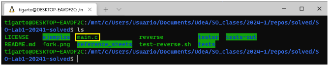
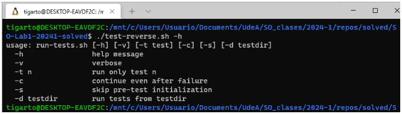
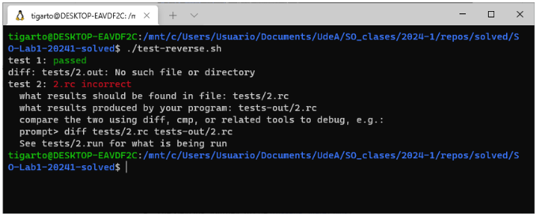
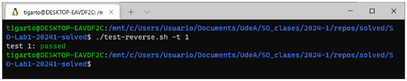
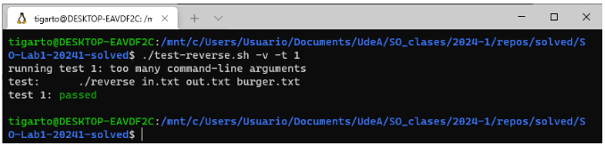
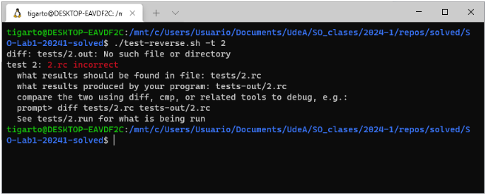
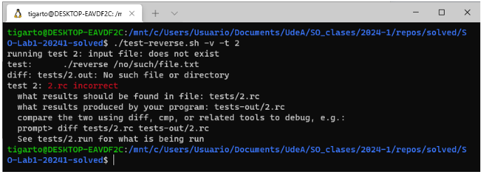

# Practica 1

## Enunciado

El enunciado y los recursos necesarios para el desarrollo de la **practica 1** del laboratorio se encuentra en el siguiente [link](https://github.com/udea-so/SO-Lab1-20241).

## Sobre los test

En el directorio [raíz](https://github.com/udea-so/SO-Lab1-20241/tree/main) del repositorio repositorio de la practica se encuentra el script [test-reverse.sh](https://github.com/udea-so/SO-Lab1-20241/blob/main/test-reverse.sh) que realiza los tests automáticos de la práctica. La práctica estará completa cuando todos los test hayan sido exitosos (Para mas información sobre estos consulte el siguiente [link](https://github.com/udea-so/SO-Lab1-20241/tree/main/tester)).

Para trabajar el primer paso después de clonar localmente el repositorio, es crear en el directorio raíz, el archivo donde va a realizar la solución de la práctica. Suponiendo que creó un archivo llamado `main.c` para colocar allí la solución tenemos:



Para saber los detalles de ejecución del script se pueden consultar el `help`:

```
./test-reverse.sh -h
```

El resultado es similar a lo que se muestra a continuación:



Según lo anterior, para ejecutar ***todos*** los test se pueden emplear cualquiera de los siguientes comandos:

```
./test-reverse.sh       # Ejecucion de los test
./test-reverse.sh -v    # Ejecucion de los test con log
```

Por ejemplo, en la siguiente figura se llevo a cabo la ejecución del primero de los comandos anteriormente mostrados:



Si lo que se desea es la ejecución de un **solo** test específico, se usa el siguiente comando:

```
./test-reverse.sh -t NUMERO_PRUEBA  # Ejecucion de un test determinado
./test-reverse.sh -v -t NUMERO_PRUEBA # Ejecucion de un test determinado con log
```

La siguiente figura muestra el caso en el que se ejecuta el ***test 1*** sin tener los resultados de la salida de manera detallada:



La siguiente figura muestra el test anterior pasando al script los argumentos para hacer que la salida se muestre de manera detallada:



La siguientes figuras muestran ambos casos para el ***test 2***:






## 6. Referencias

* https://www.mit.edu/~amidi/teaching/data-science-tools/tutorial/working-with-git/
* https://bootlin.com/blog/command-line/
* https://www.csl.cornell.edu/courses/ece2400/
* https://hackingcpp.com/cpp/cheat_sheets.html
* https://x.com/b0rk
* https://wizardzines.com/
* https://github.com/jvns
* https://jvns.ca/
* https://realpython.com/c-for-python-programmers/
* https://diveintosystems.org/book/Appendix1/index.html
* https://techdevguide.withgoogle.com/paths/data-structures-and-algorithms/