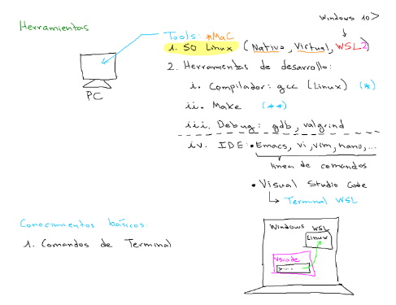

# Sesión 0 - Presentacion del laboratorio

**Fecha**: 

## 1. Sondeo

Este sondeo se realizo entre los estudiantes de la modalidad virtual

|#|Pregunta|Si|No|Total|
|---|---|---|---|---|
|1|¿Ha trabajado antes con un Linux o un SO diferente de Windows?|13|8|21|
|2|¿Ha trabajado con la terminal (no importa el sistema operativo)?|19|2|21|
|3|¿Ha trabajado con el lenguaje C o C++?|0|21|21|
|4|¿Tiene alguna distribución de linux en la máquina en la que hace los trabajos de la universidad?|7|13|21|

## 2. Herramientas necesarias

La siguiente lista muestra las herramientas que se van a emplear a lo largo del laboratorio:

- [x] Cualquier distribución de Linux (Ubuntu, WSL,...) [[link]](https://udea-so.github.io/udea-so/docs/laboratorio/tutoriales/herramientas/linux/)
- [x] Compilador gcc [[link]](https://udea-so.github.io/udea-so/docs/laboratorio/tutoriales/herramientas/gcc/)
- [x] Git [[link]](https://learn.microsoft.com/es-es/training/modules/intro-to-git/)
- [x] Github [[link]](https://learn.microsoft.com/es-es/training/modules/introduction-to-github/)

## 3. Lenguaje de programación

El lenguaje C seré el empleado para el desarrollo de las practicas de laboratorio. A continuación, se muestran algunos recursos de utilidad:

1. **Introducción al lenguaje C** (Apuntes de clase)  [[link]](https://udea-so.github.io/intro-c/intro.html)
2. **C for Java Programmers** (Dive into Systems) [[link]](https://diveintosystems.org/book/Appendix1/index.html)
3. **C for Python Programmers** (Real Python) [[link]](https://realpython.com/c-for-python-programmers/)

## 4. Recursos adicionales

1. https://github.com/isLinXu/Stanford-CS-Course/blob/main/README.en.md
2. https://www.mit.edu/~amidi/teaching/data-science-tools/
3. https://bootlin.com/
4. https://github.com/bootlin
5. http://intrologic.stanford.edu/homepage/index.html
6. https://see.stanford.edu/Course
7. https://web.stanford.edu/class/cs106x/
8. https://web.stanford.edu/class/cs107/
9. https://web.stanford.edu/class/cs110/
10. https://web.stanford.edu/class/cs101/
11. https://web.stanford.edu/class/cs102/
12. https://web.stanford.edu/class/cs103/
13. https://web.stanford.edu/class/cs105/
14. https://cs344-stanford.github.io/
15. https://josejuansanchez.org/daw/
