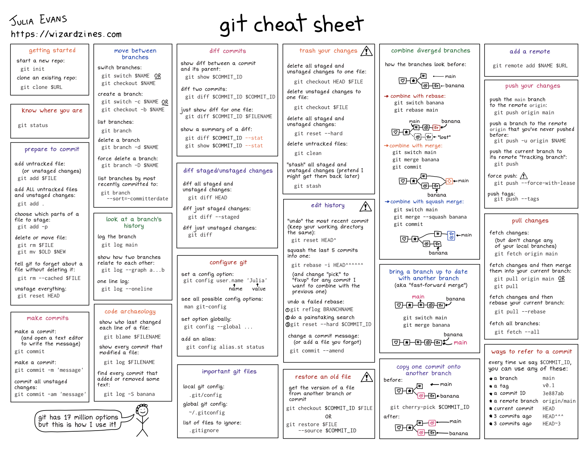

# Uso básico del `git`

La mejor forma de empezar a conocer el `git` es a traves del **git cheat sheet** de [Julia Evans](https://x.com/b0rk)

Para la práctica, no son muchos los conceptos de git que se necesitan, básicamente el trabajo se reduce a manejar los siguientes comandos:

<table>
<thead>
  <tr>
    <th colspan="2"> Comandos git basicos
  </th>
  </tr>
  </thead>
<tbody>
  <tr>
  <td colspan="2"> <b> Creación de repositorios </b></td>
  <tr>
    <td><code>git config --global user.name "[name]"</code></td>
    <td>Establece el nombre que desea esté anexado a sus transacciones de commit</td>
  </tr>
  <tr>
    <td><code>git config --global user.email "[email address]"</code></td>
    <td>Establece el e-mail que desea esté anexado a sus transacciones de commit</td>
  </tr>
  <tr>
    <td colspan="2"><b> Creación de repositorios</b></td>
  </tr>
  <tr>
    <td><code>git clone [url]</code></td>
    <td>Descarga un proyecto y toda su historia de versión</td>
  </tr>
  <tr>
    <td colspan="2"><b> Creación de repositorios </b></td>
  </tr>
  <tr>
    <td><code>git status</code></td>
    <td>Enumera todos los archivos nuevos o modificados que se deben confirmar</td>
  </tr>
  <tr>
    <td><code>git add [file]</code></td>
    <td>Toma una instantánea del archivo para preparar la versión</td>
  </tr>
  <tr>
    <td><code>git commit -m "[descriptive message]"</code></td>
    <td>Registra las instantáneas del archivo permanentemente en el historial de versión</td>
  </tr>
  <tr>
    <td colspan="2"><b> Creación de repositorios </b></td>
  </tr>
  <tr>
    <td><code>git push [alias] [branch]</code></td>
    <td>Carga todos los commits de la rama local al GitHub</td>
  </tr>
  <tr>
    <td><code>git pull</code></td>
    <td>Descarga el historial del marcador e incorpora cambios</td>
  </tr>
</tbody>
</table>

En el siguiente [link](https://rogerdudler.github.io/git-guide/index.es.html) se ilustra y explica muy bien lo más necesario.

A continuación, se comparten algunos resúmenes que le pueden servir, el cacharreo va de cuenta suya:

#### Reference sheet

> 1. **Git Cheat Sheet** (github) [[link]]([command_memento.pdf](https://training.github.com/downloads/github-git-cheat-sheet.pdf))
> 2. **Git Cheat Sheet** (Roger Dudler) [[link]](https://rogerdudler.github.io/git-guide/files/git_cheat_sheet.pdf)
> 3. **Git Cheat Sheet** (GitLab) [[link]](https://about.gitlab.com/images/press/git-cheat-sheet.pdf)
> 4. **Git Cheat Sheet** (github) [[español]](https://training.github.com/downloads/es_ES/github-git-cheat-sheet.pdf) [[ingles]](https://education.github.com/git-cheat-sheet-education.pdf)
